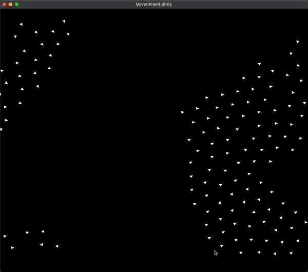

# Government Birds

## OVERVIEW

This C++ program uses OpenGL to demonstrate the implementation of Boids' Laws.

**Boids Algorithm**

## TOOLS

[OpenGL](https://www.opengl.org)
- Open Graphics Library: application programming interface (API) that allows graphical display

[Build Configurations](https://code.visualstudio.com/docs/editor/tasks)
- build tasks allow automation of builds leading to ease of configuring specific builds and switching between tasks

## CONCEPTS

***Boids Algorithm***
- set of laws created by Craig Reynolds 1987 paper: "Flock's, Herds, and Schools; A Distributed Behavioral Model"
- three laws:
    - separation
    - cohesion
    - allignment

***Object Oriented Programming***
- programming model organizing design around objects, focusing on creating abstractions with clear relationships and scopesas

## SOURCES

- https://vanhunteradams.com/Pico/Animal_Movement/Boids-algorithm.html